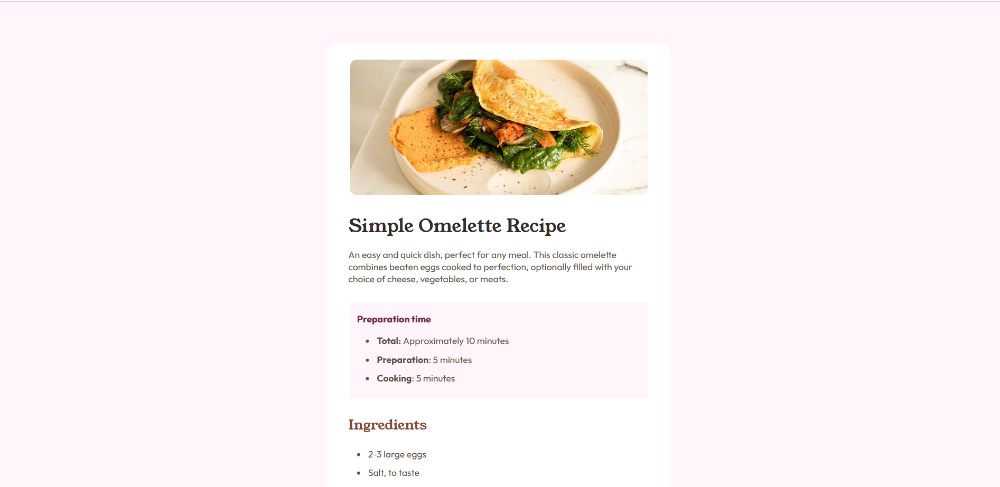

# Frontend Mentor - Recipe page solution

This is a solution to the [Recipe page challenge on Frontend Mentor](https://www.frontendmentor.io/challenges/recipe-page-KiTsR8QQKm). Frontend Mentor challenges help you improve your coding skills by building realistic projects. 

## Table of contents

- [Overview](#overview)
  - [The challenge](#the-challenge)
  - [Screenshot](#screenshot)
  - [Links](#links)
- [My process](#my-process)
  - [Built with](#built-with)
  - [What I learned](#what-i-learned)
  - [Continued development](#continued-development)
  - [Useful resources](#useful-resources)
- [Author](#author)
- [Acknowledgments](#acknowledgments)

**Note: Delete this note and update the table of contents based on what sections you keep.**

## Overview

### Screenshot

### Links

- Solution URL: [https://github.com/yaywonah/Recipe-Card](solution)
- Live Site URL: [https://yaywonah.github.io/Recipe-Card/](Live Site)

## My process

### Built with

- Semantic HTML5 markup
- CSS custom properties
- Flexbox
- Mobile-first workflow

### What I learned

- Figuring out how to code the line break in CSS with the hr tag and how to style it with CSS.
- Learning how to use the marker tag in order to make the ordered list numbers the color brown. 
- Also deciding between using a table or a div tag for the last section. I tried out the div using p tags and hr for the line breaks, but I also had to put a different class for each span and put a different margin value but I felt like there had to be an easier way.
- I switched to using table and ran into the problem of border-bottom because it showed up underneat the fat 22g column while it wasn't there in the design. had to add a class to the last td tr and added border: none;

### Useful resources

- [markers](https://stackoverflow.com/questions/488830/ol-with-numbers-another-color) - learned about markers

## Author

- Frontend Mentor - [@yourusername](https://www.frontendmentor.io/profile/yourusername)

**Note: Delete this note and add/remove/edit lines above based on what links you'd like to share.**
